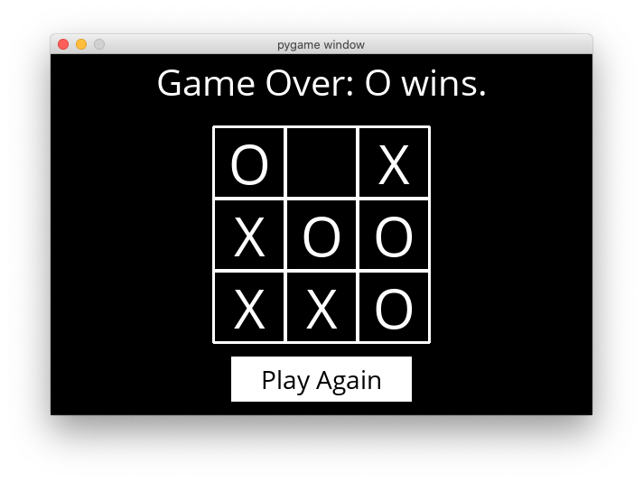

[Tic-Tac-Toe](#tic-tac-toe)
===========================

Implementation of Tic-Tac-Toe using the Minimax algorithm with alpha-beta pruning.

## **How to play**

● pip3 install -r requirements.txt

● python3 runner.py

There are two main files in this project: `runner.py` and `tictactoe.py`. `tictactoe.py` contains all of the logic for playing the game, and for making optimal moves. `runner.py` contains all of the code to run the graphical interface for the game. 

The three variables: `X`, `O`, and `EMPTY`, represent possible moves of the board. The board is represented as a list of three lists (representing the three rows of the board), where each internal list contains three values that are either `X`, `O`, or `EMPTY`.

*   The `player` function takes a `board` state as input, and returns which player’s turn it is (either `X` or `O`).

*   The `actions` function returns a `set` of all of the possible actions that can be taken on a given board.

*   The `result` function takes a `board` and an `action` as input, and returns a new board state, without modifying the original board.
   
*   The `winner` function takes a `board` as input, and returns the winner of the board if there is one.

*   The `terminal` function takes a `board` as input, and returns a boolean value indicating whether the game is over.

*   The `utility` function takes a terminal `board` as input and outputs the utility of the board.

*   The `minimax` function takes a `board` as input, and returns the optimal move for the player to move on that board.